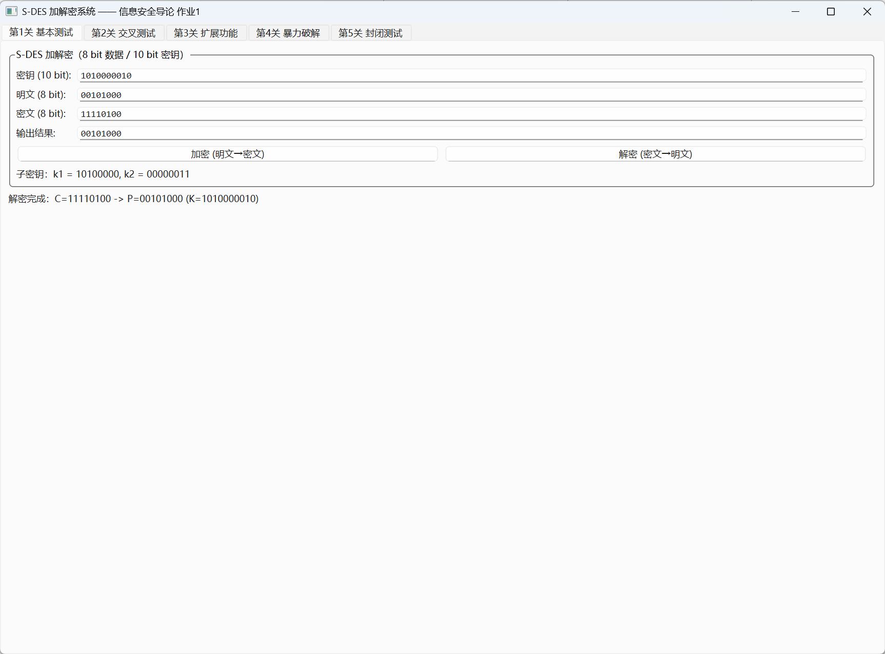
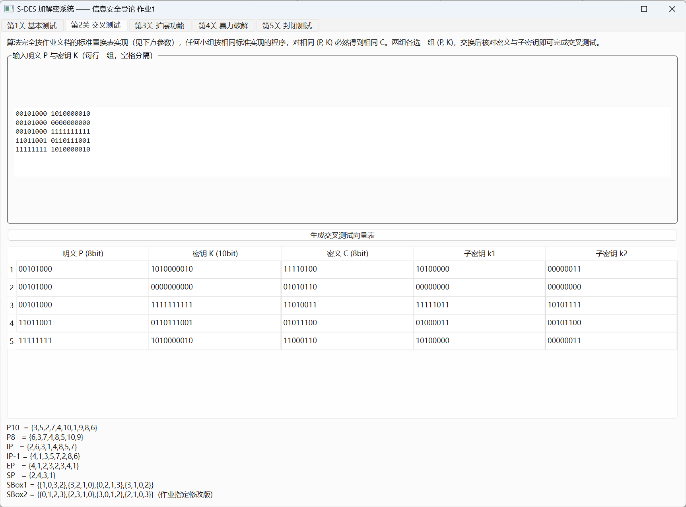
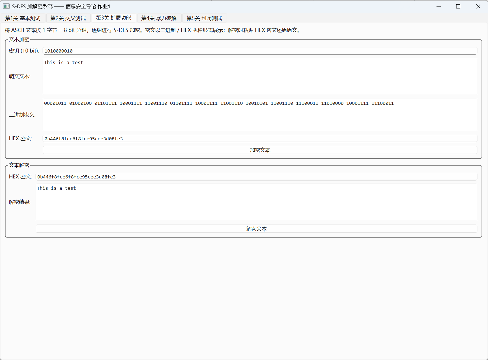
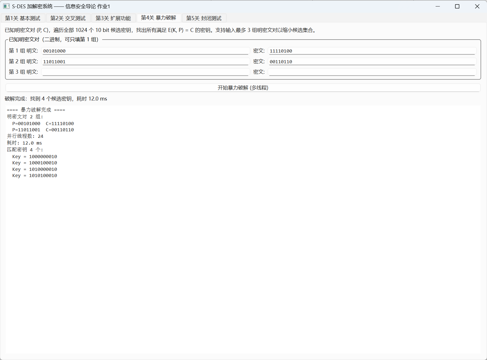
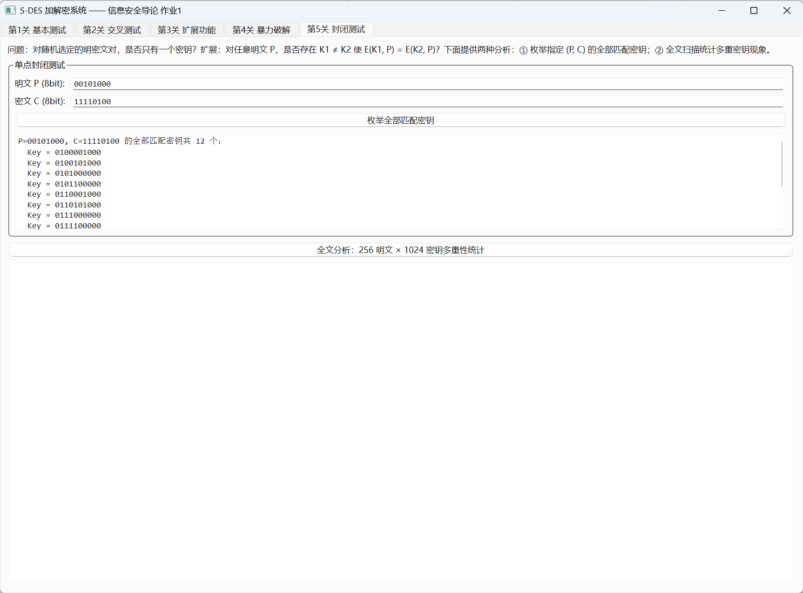
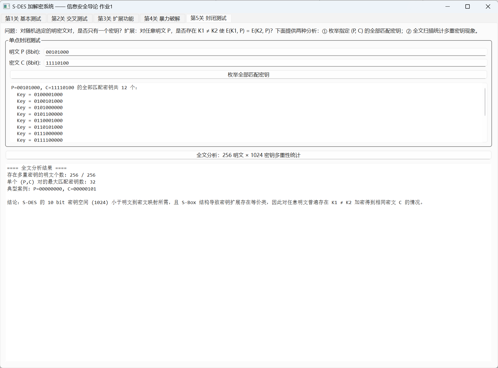

# S-DES 加解密系统（C++ / Qt）—— 信息安全导论 作业1

基于作业文档标准参数实现的 S-DES（Simplified DES）加密系统，包含：

- **核心算法库**（纯 C++，无第三方依赖）：`src/sdes.h` / `src/sdes.cpp`
- **控制台程序** `sdes_console`：交叉测试、暴力破解、封闭测试分析、自检
- **Qt GUI 程序** `sdes_gui`：覆盖全部 5 个关卡的可视化交互界面

## 一、算法标准（与作业文档一致）

| 参数 | 值 |
|------|------|
| 分组长度 | 8 bit |
| 密钥长度 | 10 bit |
| 加密流程 | C = IP⁻¹( fk₂( SW( fk₁( IP(P) ) ) ) ) |
| 解密流程 | P = IP⁻¹( fk₂( SW( fk₁( IP(C) ) ) ) )，子密钥先 k₂ 后 k₁ |
| 密钥扩展 | k₁ = P8(Shift¹(P10(K)))，k₂ = P8(Shift³(P10(K))) |

置换表（注意 **SBox2 为作业文档指定修改版**，与 PPT 版本不同）：

```
P10  = {3,5,2,7,4,10,1,9,8,6}
P8   = {6,3,7,4,8,5,10,9}
IP   = {2,6,3,1,4,8,5,7}
IP-1 = {4,1,3,5,7,2,8,6}
EP   = {4,1,2,3,2,3,4,1}
SP   = {2,4,3,1}
SBox1 = {{1,0,3,2},{3,2,1,0},{0,2,1,3},{3,1,0,2}}
SBox2 = {{0,1,2,3},{2,3,1,0},{3,0,1,2},{2,1,0,3}}
```

## 二、构建方法

### 控制台程序（任意平台，仅需 C++17 编译器）

```bash
g++ -std=c++17 -O2 src/sdes.cpp src/main_console.cpp -o sdes_console
# 或使用 CMake（未安装 Qt 时自动跳过 GUI）
cmake -B build && cmake --build build
```

### Qt GUI 程序

依赖 Qt 5.14+ / Qt 6（Widgets + Concurrent 模块）与 CMake ≥ 3.16：

```bash
cmake -B build -DCMAKE_PREFIX_PATH=<Qt安装路径>/<版本>/<编译器>
cmake --build build
```

本机验证环境（Windows）：Qt 6.8.3 (mingw_64) + MinGW 13.1.0：

```bash
cmake -B build-qt -G "MinGW Makefiles" -DCMAKE_PREFIX_PATH=E:/Qt/6.8.3/mingw_64 \
      -DCMAKE_CXX_COMPILER=E:/Qt/Tools/mingw1310_64/bin/g++.exe
cmake --build build-qt
```

也可直接用 **Qt Creator** 打开 `CMakeLists.txt` 运行。

GUI 还支持自动截图模式（用于报告配图）：`sdes_gui --capture screenshots`，
程序会依次自动执行各关卡操作并保存窗口截图到 `screenshots/` 目录。

## 三、功能与关卡对照

| 关卡 | 功能 | 入口 |
|------|------|------|
| 1 基本测试 | 8bit 明文/密文 与 10bit 密钥的加密、解密，显示子密钥 k1/k2 | GUI 第1页 |
| 2 交叉测试 | 输入多组 (P, K) 批量生成 (C, k1, k2) 对照表，供两组交换核对 | GUI 第2页 / 控制台 encrypt |
| 3 扩展功能 | ASCII 文本按字节分组加解密，二进制/HEX 展示 | GUI 第3页 / 控制台 textenc/textdec |
| 4 暴力破解 | 1~3 组已知明密文对，QtConcurrent 多线程遍历 1024 密钥并计时 | GUI 第4页 / 控制台 bruteforce |
| 5 封闭测试 | 枚举 (P,C) 全部匹配密钥；256×1024 全文多重性统计 | GUI 第5页 / 控制台 closure/analysis |

## 四、测试结果

GUI 实际运行截图见 [`screenshots/`](screenshots/) 目录（由 `sdes_gui --capture` 自动生成）。

### 4.0 GUI 运行截图（关卡 1~4）

| 关卡 | 截图 |
|------|------|
| 第1关 基本测试（加密） |  |
| 第1关 基本测试（解密） |  |
| 第2关 交叉测试向量表 |  |
| 第3关 文本加解密 |  |
| 第4关 多线程暴力破解 |  |
| 第5关 封闭测试（附加） |  /  |

### 4.1 自检（加解密往返一致性）

全部 256 明文 × 1024 密钥 = 262144 组合，解密(加密(P)) = P 全部通过：

```
==== S-DES 自检 ====
[PASS] 加解密往返一致性: 256 x 1024 = 262144 组全部通过
```

### 4.2 第1关：基本测试参考向量

| 明文 P | 密钥 K | 密文 C |
|--------|--------|--------|
| 00101000 | 1010000010 | 11110100 |
| 00101000 | 0000000000 | 01010110 |
| 00101000 | 1111111111 | 11010011 |
| 00101000 | 0110111001 | 00011000 |

### 4.3 第3关：文本加密

明文 `This is a test`，密钥 `1010000010`：

```
ASCII密文(HEX) : 0b446f8fce6f8fce95cee3d08fe3
```

解密后还原为 `This is a test`。

### 4.4 第4关：暴力破解

GUI 实测（24 并行线程，双组明密文对）：耗时约 12~19 ms，找到 4 个候选密钥
（1000000010 / 1000100010 / 1010000010 / 1010100010），见 `screenshots/05_关卡4_暴力破解.png`。

控制台程序结果（单线程遍历，16 线程版 bruteForceMT 同样支持）——
已知对：P=00101000, C=11110100：

```
匹配密钥数 : 12
Key = 0100001000, 0100101000, 0101000000, 0101100000,
      0110001000, 0110101000, 0111000000, 0111100000,
      1000000010, 1000100010, 1010000010, 1010100010
耗时约 1.2 ms（密钥空间仅 1024，近乎瞬时）
```

可见**单对明密文不足以唯一确定密钥**（12 个候选）。追加第二组明密文对
（P=11011001, C=00110110）后候选集合缩小到 4 个（1000000010 / 1000100010 / 1010000010 / 1010100010），
验证了"多对约束提升破解确定性"；理论上继续增加约束对可进一步逼近唯一密钥。

### 4.5 第5关：封闭测试结论

对全部 256 个明文逐一扫描 1024 个密钥：

- **存在多重密钥的明文个数：256 / 256** —— 任意明文都存在 K1 ≠ K2 加密到相同密文的情况；
- 单个 (P,C) 对最多被 **32 个不同密钥**映射到（如 P=00000000, C=00000101）；
- 结论：S-DES 密钥扩展中 P10 置换 + 循环移位的结构使部分密钥等价（子密钥对 (k1,k2) 相同），因此密钥映射**非单射**，仅凭单条明密文对无法唯一确定原始密钥。

## 五、文档

- **用户指南**：见本文档"功能与关卡对照"，GUI 各页均有操作说明文字；
- **开发手册（接口说明）**：核心模块 `sdes.h` 为唯一算法入口，对外接口：

```cpp
uint8_t  encrypt(uint8_t plaintext, uint16_t key10);   // 加密
uint8_t  decrypt(uint8_t ciphertext, uint16_t key10);  // 解密
void     generateSubKeys(uint16_t key10, uint8_t& k1, uint8_t& k2);
std::vector<uint16_t> bruteForce(const std::vector<std::pair<uint8_t,uint8_t>>& pairs);
std::vector<uint16_t> findAllKeys(uint8_t plaintext, uint8_t ciphertext);
std::string toBinaryString(uint16_t value, int bits);
bool parseBinaryString(const std::string& text, int bits, uint16_t& out);
```

GUI 层（`mainwindow.cpp`）仅调用上述接口，未重复实现算法逻辑；
控制台层（`main_console.cpp`）同样仅调用 `sdes.h`，可用于脚本化交叉测试。

## 六、代码规范说明

- 命名：类/函数采用 CamelCase 或小驼峰（`generateSubKeys`、`MainWindow`），常量表全大写（`P10`、`SBOX1`）；
- 注释：每个函数说明用途与位序约定（MSB 在前，置换表 1 起始编号）；
- 模块化：算法（sdes）与界面（mainwindow）/命令行（main_console）彻底分离，算法层可独立单元测试。

## 七、环境

- C++17，MinGW-w64 GCC 14 / MSVC 均可编译核心库
- GUI：Qt 5.14+ / Qt 6（Widgets、Concurrent）
- 构建：CMake 3.16+ 或 Qt Creator
