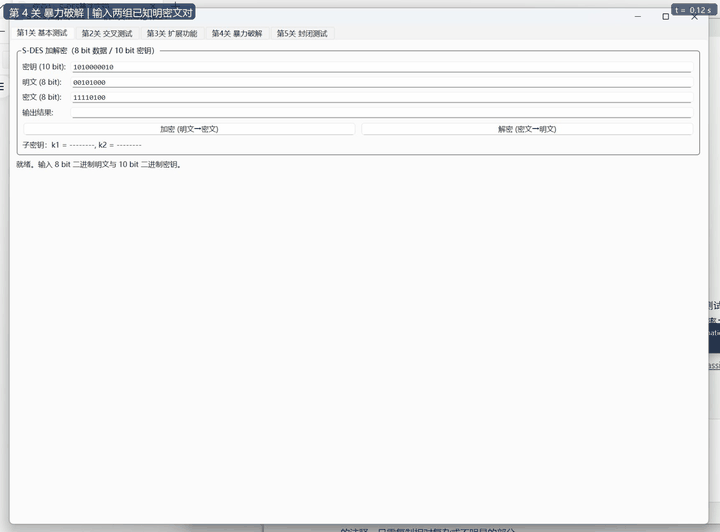

# S-DES 加解密系统（C++ / Qt）—— 信息安全导论 作业1

基于作业文档标准参数实现的 S-DES（Simplified DES）加密系统，包含：

- **5 个关卡目录**（`关卡1_基本测试/` ~ `关卡5_封闭测试/`）：每关一个可独立编译运行的示例程序 + 说明文档
- **核心算法库**（纯 C++，无第三方依赖）：`src/sdes.h` / `src/sdes.cpp`
- **控制台程序** `sdes_console`：交叉测试、暴力破解、封闭测试分析、自检
- **Qt GUI 程序** `sdes_gui`：覆盖全部 5 个关卡的可视化交互界面

## 一、算法标准（与作业文档一致）

| 参数 | 值 |
|------|------|
| 分组长度 | 8 bit |
| 密钥长度 | 10 bit |
| 加密流程 | C = IP⁻¹( fk₂( SW( fk₁( IP(P) ) ) ) ) |
| 解密流程 | P = IP⁻¹( fk₂( SW( fk₁( IP(C) ) ) ) )，子密钥先 k₂ 后 k₁ |
| 密钥扩展 | k₁ = P8(Shift¹(P10(K)))，k₂ = P8(Shift³(P10(K))) |

置换表（注意 **SBox2 为作业文档指定修改版**，与 PPT 版本不同）：

```
P10  = {3,5,2,7,4,10,1,9,8,6}
P8   = {6,3,7,4,8,5,10,9}
IP   = {2,6,3,1,4,8,5,7}
IP-1 = {4,1,3,5,7,2,8,6}
EP   = {4,1,2,3,2,3,4,1}
SP   = {2,4,3,1}
SBox1 = {{1,0,3,2},{3,2,1,0},{0,2,1,3},{3,1,0,2}}
SBox2 = {{0,1,2,3},{2,3,1,0},{3,0,1,2},{2,1,0,3}}
```

## 二、代码组织（按关卡分类）

仓库根目录下的 5 个文件夹与作业的 5 个关卡一一对应，每个文件夹内有
**可独立编译运行的示例程序** `main.cpp` 与说明文档 `README.md`：

```
关卡1_基本测试/     8bit 明文 + 10bit 密钥的加解密（含全过程分步打印）
关卡2_交叉测试/     20 组参考向量表 + 回归校验 + 批量核对（stdin 模式）
关卡3_扩展功能/     ASCII 字符串分组加解密（ECB，HEX/二进制输出）
关卡4_暴力破解/     多线程遍历 1024 密钥并计时（单次破解 + 压力测试 + 加速比）
关卡5_封闭测试/     密钥多重性三层分析（等价类/碰撞/全空间分布）+ 结论论证
```

公共源码（各关卡共用，避免重复实现）：

```
src/sdes.h / sdes.cpp              核心算法：置换表、Keygen、加解密、暴力破解
src/bruteforce_mt.h / .cpp         第 4 关多线程暴力破解模块
src/sdes_analysis.h / .cpp         第 5 关密钥多重性分析模块
src/console_utils.h                命令行参数解析 / 位串打印（纯头文件）
src/main_console.cpp               一体化命令行工具（所有关卡功能的总入口）
src/mainwindow.* / main_gui.cpp    Qt GUI（5 个页签对应 5 个关卡）
```

截图按关卡存放于 `screenshots/关卡N_xxx/`，第 4 关演示视频在 `video/`
（**在线观看方式见 [`video/README.md`](video/README.md)**）。

## 三、构建方法

### 一键脚本（最简单）

```bash
./build_levels.sh            # 编译 5 个关卡程序 + 控制台工具，产物在 bin/
./build_levels.sh run save   # 编译并依次运行，输出保存到 关卡测试输出/
```

### CMake（生成器建议用 Ninja）

```bash
cmake -B build -G Ninja -DCMAKE_BUILD_TYPE=Release
cmake --build build
```

> Windows + MinGW 的已知限制：汇编器无法在**非 ASCII 路径**下创建 `.obj`，
> 而本仓库的关卡目录名是中文。CMakeLists 中已通过
> `add_subdirectory(<中文源目录> <ASCII 二进制目录>)` 规避目标文件路径问题；
> 但 "MinGW Makefiles" 生成器还会把中文源路径乱码传给编译器，因此
> **请使用 Ninja 生成器**（Qt Creator 默认即 Ninja），或直接用上面的脚本。

### 手动 g++ 编译（以关卡 1 为例）

```bash
g++ -std=c++17 -O2 -I src src/sdes.cpp src/bruteforce_mt.cpp 关卡1_基本测试/main.cpp \
    -o level1_basic_test -pthread
```

### Qt GUI 程序

依赖 Qt 5.14+ / Qt 6（Widgets + Concurrent 模块）与 CMake ≥ 3.16：

```bash
cmake -B build -G Ninja -DCMAKE_PREFIX_PATH=<Qt安装路径>/<版本>/<编译器>
cmake --build build
```

本机验证环境（Windows）：Qt 6.8.3 (mingw_64) + MinGW 13.1.0：

```bash
cmake -B build-qt -G Ninja -DCMAKE_PREFIX_PATH=E:/Qt/6.8.3/mingw_64 \
      -DCMAKE_CXX_COMPILER=E:/Qt/Tools/mingw1310_64/bin/g++.exe
cmake --build build-qt
```

也可直接用 **Qt Creator** 打开 `CMakeLists.txt` 运行。

GUI 还支持自动截图模式（用于报告配图）：`sdes_gui --capture screenshots`，
程序会依次自动执行各关卡操作，并把截图保存到 `screenshots/关卡N_xxx/` 子目录。

## 四、功能与关卡对照

| 关卡 | 功能 | 独立程序 | 入口 |
|------|------|----------|------|
| 1 基本测试 | 8bit 明文/密文 与 10bit 密钥的加密、解密，显示子密钥 k1/k2 | `关卡1_基本测试/` | GUI 第1页 |
| 2 交叉测试 | 输入多组 (P, K) 批量生成 (C, k1, k2) 对照表，供两组交换核对 | `关卡2_交叉测试/` | GUI 第2页 / 控制台 encrypt |
| 3 扩展功能 | ASCII 文本按字节分组加解密，二进制/HEX 展示 | `关卡3_扩展功能/` | GUI 第3页 / 控制台 textenc/textdec |
| 4 暴力破解 | 1~3 组已知明密文对，QtConcurrent 多线程遍历 1024 密钥并计时 | `关卡4_暴力破解/` | GUI 第4页 / 控制台 bruteforce |
| 5 封闭测试 | 单点密钥枚举 + 密钥等价类/明文碰撞/全空间分布三层分析 | `关卡5_封闭测试/` | GUI 第5页 / 控制台 closure/keyclasses/collision/profile/analysis-full |

## 五、测试结果

GUI 实际运行截图见 [`screenshots/`](screenshots/) 目录（按关卡分子目录存放，
由 `sdes_gui --capture` 自动生成）。

### 5.0 GUI 运行截图（关卡 1~5）

| 关卡 | 截图 |
|------|------|
| 第1关 基本测试（加密） |  |
| 第1关 基本测试（解密） |  |
| 第2关 交叉测试向量表 |  |
| 第3关 文本加解密 |  |
| 第4关 多线程暴力破解 | ，演示视频/动图见 [5.4 节](#54-第4关暴力破解) 与 [`video/`](video/) |
| 第5关 封闭测试 |      |

### 5.1 自检（加解密往返一致性）

全部 256 明文 × 1024 密钥 = 262144 组合，解密(加密(P)) = P 全部通过：

```
==== S-DES 自检 ====
[PASS] 加解密往返一致性: 256 x 1024 = 262144 组全部通过
```

### 5.2 第1关：基本测试参考向量

| 明文 P | 密钥 K | 密文 C |
|--------|--------|--------|
| 00101000 | 1010000010 | 11110100 |
| 00101000 | 0000000000 | 01010110 |
| 00101000 | 1111111111 | 11010011 |
| 00101000 | 0110111001 | 00011000 |

### 5.3 第3关：文本加密

明文 `This is a test`，密钥 `1010000010`：

```
ASCII密文(HEX) : 0b446f8fce6f8fce95cee3d08fe3
```

解密后还原为 `This is a test`。

### 5.4 第4关：暴力破解

**演示动图（在本页直接播放，GitHub 会把仓库内 GIF 渲染为动画）：**



> 完整 14 秒视频：[`video/关卡4_暴力破解演示.mp4`](video/关卡4_暴力破解演示.mp4)
> —— 观看方式见下方「如何查看 MP4 视频」。

视频记录了 GUI 实机运行的完整过程：

1. **单次暴力破解**：24 线程并行遍历 1024 个候选密钥，**10.8 ms** 完成，找到 4 个候选密钥；
2. **批量压力测试**：连续遍历密钥空间 **1,000,000 次**（累计 10.24 亿次 S-DES 加密），
   进度条 + 实时计时显示，**总耗时 2.816 s**，吞吐 **363 M 次加密/秒**，
   并发加速比 **19.6x**（相对单线程实测基准 18.5 M 次加密/秒）。

> 结论：S-DES 密钥空间仅 2^10 = 1024（有效熵 8 bit），每秒可穷举约 35 万个密钥空间，
> 单次全空间遍历不足 0.003 ms —— 密钥长度过短使暴力破解在毫秒级即可完成。

GUI 截图见 `screenshots/关卡4_暴力破解/05_暴力破解.png`；录像可用
`sdes_gui --record frames` + `python tools/make_video.py <frames绝对路径>` 复现。

#### 如何查看 MP4 视频（GitHub 不支持在仓库页内播放 MP4）

GitHub 的文件页对 `.mp4` 只提供 **Download / View raw**；而 `raw.githubusercontent.com`
返回的 `Content-Type` 是 `application/octet-stream`，浏览器只会**下载**、不会播放。
实测（`curl -I`）确认这一点，因此三种方式任选其一：

| 方式 | 操作 | 说明 |
|------|------|------|
| ① 在线播放（最简单） | 点 **[▶ 在线播放视频](https://cdn.jsdelivr.net/gh/Baileipeng/information-security-assignment-1@main/video/关卡4_暴力破解演示.mp4)** | jsDelivr 公共 CDN，实测返回 `Content-Type: video/mp4`，浏览器**点开即播**、可拖动进度 |
| ② 下载后本地播放 | 在 GitHub 打开 [video/关卡4_暴力破解演示.mp4](video/关卡4_暴力破解演示.mp4) → 点 **Download** 或 **View raw** | 文件仅 331 KB，本地播放器打开即可 |
| ③ 让 README 内嵌原生播放器 | 把 mp4 **拖进任意 Issue / PR 的评论框**上传，复制 GitHub 返回的 `https://github.com/user-attachments/assets/...` 链接，单独占一行贴进 README | 只有 `user-attachments` 形式的链接会被 GitHub 渲染成播放器；仓库内相对路径和 Release 附件都只会显示为下载链接 |

> 只想在 GitHub 页面上直接看到画面变化的话，上面的 **GIF 已经内嵌在本页**，滚动到此处即自动播放；
> GIF 是仓库内唯一能被 GitHub 直接渲染成动画的视频格式。

> 镜像备用：若 `cdn.jsdelivr.net` 打不开，把域名换成 `gcore.jsdelivr.net` 或
> `testingcf.jsdelivr.net`（路径不变），三者实测均返回 `video/mp4`。
> 链接中的中文文件名若有编码问题，可用百分号编码：
> `.../video/%E5%85%B3%E5%8D%A14_%E6%9A%B4%E5%8A%9B%E7%A0%B4%E8%A7%A3%E6%BC%94%E7%A4%BA.mp4`。

控制台程序结果——已知对：P=00101000, C=11110100：

```
匹配密钥数 : 12
Key = 0100001000, 0100101000, 0101000000, 0101100000,
      0110001000, 0110101000, 0111000000, 0111100000,
      1000000010, 1000100010, 1010000010, 1010100010
耗时约 1.2 ms（密钥空间仅 1024，近乎瞬时）
```

可见**单对明密文不足以唯一确定密钥**（12 个候选）。追加第二组明密文对
（P=11011001, C=00110110）后候选集合缩小到 4 个（1000000010 / 1000100010 / 1010000010 / 1010100010），
验证了"多对约束提升破解确定性"；理论上继续增加约束对可进一步逼近唯一密钥。

### 5.5 第5关：封闭测试结论

问题①：对给定的一对（明文 P，密文 C），满足 E(K,P)=C 的密钥**不唯一**。
问题②：对任意明文分组 P，**必然存在** K1 ≠ K2 使 E(K1,P)=E(K2,P)。

从三个层次递进分析（GUI 第 5 页 / `sdes_console analysis-full` 可复现）：

**① 密钥等价类分析（Keygen 输出去重）**

```
密钥总数             : 1024
不同 (k1,k2) 子密钥对: 256
等价类规模范围       : 4 ~ 4（每类恰好 4 个密钥）
=> 768 个密钥与其他密钥完全等价，密钥有效熵只有 8 bit 而非 10 bit
```

**② 明文维度碰撞检测**

```
存在碰撞的明文个数   : 256 / 256
碰撞密钥对总数       : 1615872
单 (P,C) 最大密钥数  : 32（案例 P=00000000, C=00000101）
```

**③ 全空间 (P,C) 匹配密钥数分布**

```
非空 (P,C) 对数      : 25280 / 65536
匹配密钥 ≥ 2 的对数  : 25280（100%，且个数恒为 4 的倍数）
分布: n=4:6144 对, n=8:7072, n=12:6144, n=16:4672, n=24:928, n=32:320
```

**理由说明**：P10 置换 + 循环移位 + P8 压缩使 10 bit 密钥只有 8 bit 有效——
1024 个密钥经 Keygen 塌缩为 256 个等价类（每类 4 个密钥），同类密钥的加密函数
完全相同。因此：(a) 匹配密钥个数恒为 4 的倍数，最少 4 个；(b) 65536 个 (P,C)
组合中仅 25280 个可达（密文空间被压缩）；(c) 对任意明文都存在大量等价密钥。
GUI 截图见 `screenshots/关卡5_封闭测试/`。

## 六、文档

- **用户指南**：见本文档"功能与关卡对照"，GUI 各页均有操作说明文字；
  每个关卡目录内的 `README.md` 含该关卡的**要求、用法与实测输出**；
- **开发手册（接口说明）**：核心模块 `sdes.h` 为唯一算法入口，对外接口：

```cpp
uint8_t  encrypt(uint8_t plaintext, uint16_t key10);   // 加密
uint8_t  decrypt(uint8_t ciphertext, uint16_t key10);  // 解密
void     generateSubKeys(uint16_t key10, uint8_t& k1, uint8_t& k2);
std::vector<uint16_t> bruteForce(const std::vector<std::pair<uint8_t,uint8_t>>& pairs);
std::vector<uint16_t> findAllKeys(uint8_t plaintext, uint8_t ciphertext);
BruteForceResult bruteForceParallel(pairs, threadCount = 0, rounds = 1);  // bruteforce_mt.h
std::string toBinaryString(uint16_t value, int bits);
bool parseBinaryString(const std::string& text, int bits, uint16_t& out);
```

- 各关卡的模块入口：

```cpp
// bruteforce_mt.h —— 第 4 关：多线程暴力破解（GUI / 控制台 / 关卡程序共用）
BruteForceResult bruteForceParallel(
    const std::vector<std::pair<uint8_t,uint8_t>>& pairs,
    int threadCount /*0=自动*/, int rounds /*压力测试遍数*/);

// sdes_analysis.h —— 第 5 关：密钥多重性分析（GUI / 控制台 / 关卡程序共用）
KeyEquivalenceReport     analyzeKeyEquivalence();      // ① 密钥等价类
PlaintextCollisionReport analyzePlaintextCollision();  // ② 明文碰撞
CipherProfileReport      analyzeCipherProfile();       // ③ 全空间分布
```

GUI 层（`mainwindow.cpp`）仅调用上述接口，未重复实现算法逻辑；
控制台层（`main_console.cpp`）与各关卡程序（`关卡N_xxx/main.cpp`）同样
仅调用公共模块，可用于脚本化交叉测试。

## 七、代码规范说明

- 命名：类/函数采用 CamelCase 或小驼峰（`generateSubKeys`、`MainWindow`），常量表全大写（`P10`、`SBOX1`）；
- 注释：每个函数说明用途与位序约定（MSB 在前，置换表 1 起始编号）；
- 模块化：算法（`sdes`）与界面（`mainwindow`）/命令行（`main_console`）/
  各关卡程序彻底分离；多线程破解（`bruteforce_mt`）与分析（`sdes_analysis`）
  独立成模块，供 GUI、控制台、关卡程序三处复用，算法层可独立单元测试。

## 八、环境

- C++17，MinGW-w64 GCC 13/14 / MSVC 均可编译核心库
- GUI：Qt 5.14+ / Qt 6（Widgets、Concurrent）
- 构建：CMake 3.16+（生成器建议 Ninja）或 Qt Creator；亦可直接 `./build_levels.sh`
