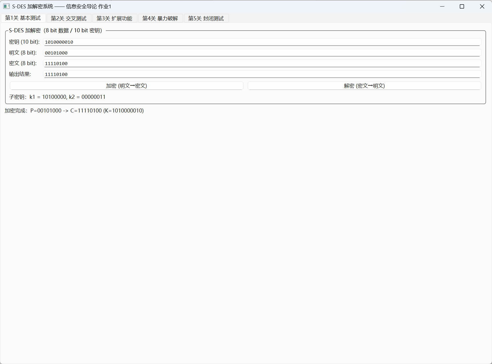

# 关卡 1：基本测试（8 bit 明文 / 10 bit 密钥加解密）

## 一、关卡要求

实现 S-DES 算法：输入 8 bit 明文与 10 bit 密钥，输出 8 bit 密文；
解密时输入密文与同一密钥，应能还原出原明文。

## 二、代码文件

| 文件 | 说明 |
|------|------|
| `main.cpp` | 本关卡独立示例程序（含密钥扩展、加解密全过程的分步打印） |
| `CMakeLists.txt` | 单独构建本关卡的构建脚本 |
| `../src/sdes.h` / `../src/sdes.cpp` | S-DES 核心算法（置换表、Keygen、加解密） |
| `../src/console_utils.h` | 命令行参数解析 / 位串打印公共工具 |

## 三、编译与运行

```bash
# 方式一：用仓库根目录的一键脚本
./build_levels.sh

# 方式二：CMake（生成器建议用 Ninja）
cmake -B build -G Ninja && cmake --build build

# 方式三：直接用 g++ 编译本关卡
g++ -std=c++17 -O2 -I../src ../src/sdes.cpp ../src/bruteforce_mt.cpp main.cpp -o level1_basic_test
```

```bash
./level1_basic_test                       # 默认 K=1010000010, P=00101000
./level1_basic_test 1111111111 00000000   # 指定密钥与明文
```

## 四、实测结果（默认参数）

```
K = 1010000010
k1 = 10100000      k2 = 00000011
P = 00101000  ->  C = 11110100  (0xF4)
解密还原      : 00101000  [PASS]
```

程序会完整打印：

1. 密钥扩展：`P10(K) -> L0/R0 -> 循环左移 -> P8 -> k1/k2`（并手工复现核对）；
2. 加密全过程：`IP -> fk1 -> SW -> fk2 -> IP^-1`，每一级中间结果；
3. 轮函数 `F(R, sk)` 展开：`EP 扩展 -> 与子密钥异或 -> SBox1/SBox2 -> SPBox`；
4. 解密全过程：结构与加密相同、子密钥逆序（先 k2 后 k1）；
5. 往返校验：解密结果 == 原明文，输出 `[PASS]`。

## 五、GUI 截图

| 截图 | 说明 |
|------|------|
|  | 加密：P=00101000 → C=11110100，显示子密钥 k1/k2 |
|  | 解密：C=11110100 → P=00101000，还原成功 |
