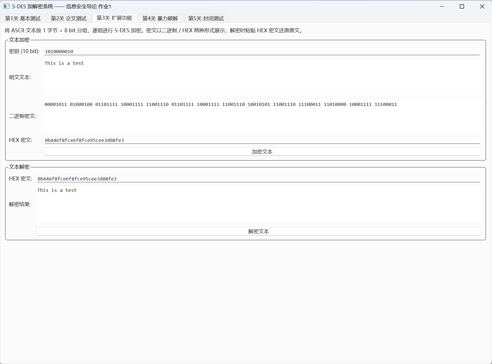

# 关卡 3：扩展功能（ASCII 字符串分组加解密）

## 一、关卡要求

S-DES 分组长度只有 8 bit，把扩展功能做成"对任意 ASCII 字符串加密"：
把字符串按字符拆成若干 8 bit 分组，逐组用同一密钥加密 / 解密。

## 二、代码文件

| 文件 | 说明 |
|------|------|
| `main.cpp` | 本关卡独立示例程序（分组明细表 + HEX 密文 + 解密还原） |
| `CMakeLists.txt` | 单独构建本关卡的构建脚本 |
| `../src/sdes.h` / `../src/sdes.cpp` | S-DES 核心算法 |

## 三、实现要点

* **分组模式**：ECB（电子密码本）——每个字符独立加密，实现最简单；
* 字符集：取每个字符的低 8 位（ASCII），非 ASCII 宽字符会被截断；
* 密文同时给出**二进制串**与 **HEX 串**，HEX 串可直接粘回解密框。

## 四、编译与运行

```bash
./build_levels.sh                 # 或 cmake -B build -G Ninja && cmake --build build
```

```bash
./level3_ascii_text                                     # 默认 "This is a test"
./level3_ascii_text 1111111111 "Hello"                  # 指定密钥与文本
./level3_ascii_text 1010000010 0b446f8fce6f8fce95cee3d08fe3 --decrypt   # 仅解密
```

## 五、实测结果

```
明文 : This is a test   (14 字符)
HEX 密文 : 0b446f8fce6f8fce95cee3d08fe3
还原文本 : This is a test   [PASS] 解密结果与原文完全一致
```

ECB 特性实测：14 个字符只产生 8 种不同密文字节（`s`→`8f`、空格→`ce`、`t`→`e3`
各自重复），说明 **ECB 是确定性加密**：相同明文分组必然得到相同密文分组，
会泄漏"哪些字符相同"的统计信息；要消除该特征需引入随机化（如 CBC / 随机 IV）。

## 六、GUI 截图

| 截图 | 说明 |
|------|------|
|  | GUI 的文本加密 + 解密往返演示 |
