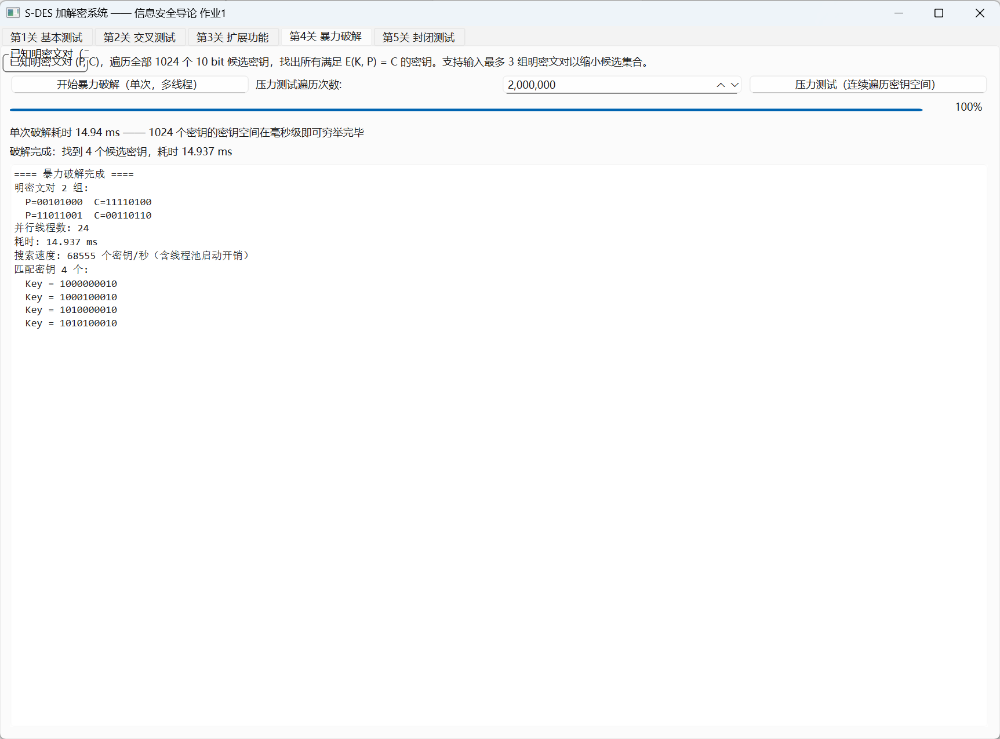

# 关卡 4：暴力破解（多线程遍历密钥空间并计时）

## 一、关卡要求

已知一组（或几组）明密文对，遍历全部 2^10 = 1024 个候选密钥，找出所有满足
`E(K, P) = C` 的密钥；要求使用**多线程**实现，并给出**破解耗时**。

## 二、代码文件

| 文件 | 说明 |
|------|------|
| `main.cpp` | 本关卡独立示例程序（单次破解 + 压力测试 + 加速比统计） |
| `CMakeLists.txt` | 单独构建本关卡的构建脚本 |
| `../src/bruteforce_mt.h` / `../src/bruteforce_mt.cpp` | 多线程暴力破解模块（GUI / 控制台共用） |
| `../src/sdes.h` / `../src/sdes.cpp` | S-DES 核心算法 |

## 三、实现要点

* 密钥空间 `[0, 1024)` 按线程数**均分**给 N 个线程（默认 `min(硬件并发数, 16)`）；
* 每个线程独立遍历自己的区间、命中即记录，最后合并并升序排序；
* 用 `std::chrono::high_resolution_clock` 统计墙钟耗时；
* `--stress N` 把整个密钥空间连续遍历 N 遍，把毫秒级耗时放大到秒级，
  便于观察真实吞吐（并测量相对单线程的加速比）。

## 四、编译与运行

```bash
./build_levels.sh                 # 或 cmake -B build -G Ninja && cmake --build build
```

```bash
./level4_bruteforce                              # 默认两组明密文对
./level4_bruteforce 00101000 11110100            # 指定一组
./level4_bruteforce --threads 8 00101000 11110100
./level4_bruteforce --stress 1000000             # 压力测试：连续遍历 100 万遍
```

## 五、实测结果

**单次破解**（两组明密文对，16 线程）：

```
遍历密钥个数 : 1024
耗时         : 1.118 ms
匹配密钥 4 个:
    K = 1000000010    K = 1000100010
    K = 1010000010    K = 1010100010
```

**压力测试**（连续遍历 100 万遍，累计约 10.24 亿次加密）：

```
[基准] 单线程耗时 : 29054.710 ms   吞吐 35.2 M 次加密/秒
[并行] 16 线程耗时 :  3771.361 ms   吞吐 271.5 M 次加密/秒
并发加速比        : 7.7 ×
```

> 单次全空间遍历仅约 **0.004 ms**——10 bit 密钥空间太小，S-DES 在此规模下
> 不具备任何实际安全性；实测耗时中相当一部分是线程创建/调度开销。

## 六、演示视频与 GUI 截图

| 内容 | 位置 |
|------|------|
| 演示视频（MP4，14 秒，含阶段字幕与时间戳） | `../video/关卡4_暴力破解演示.mp4` |
| 同内容动图（GIF） | `../video/关卡4_暴力破解演示.gif` |
| GUI 单次破解截图 |  |

视频展示了"单次毫秒级破解 → 百万遍压力测试进度条与实时计时 → 结果汇总"全过程。
