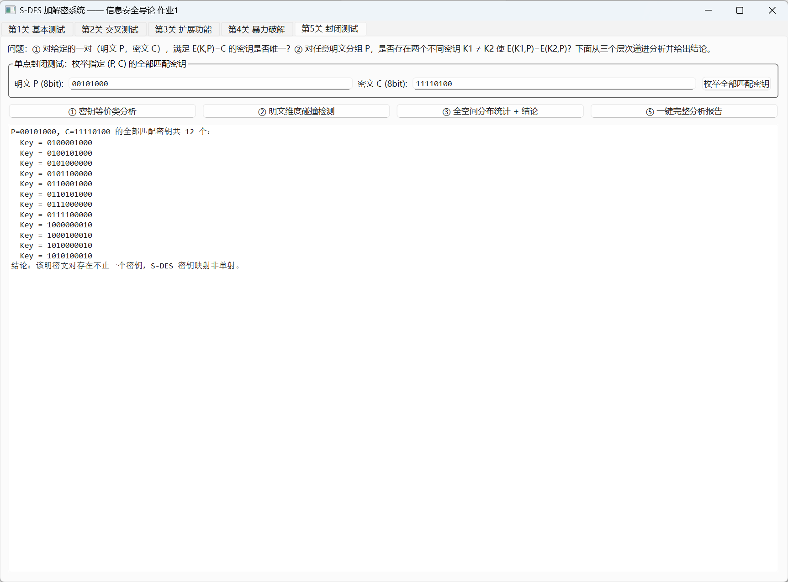
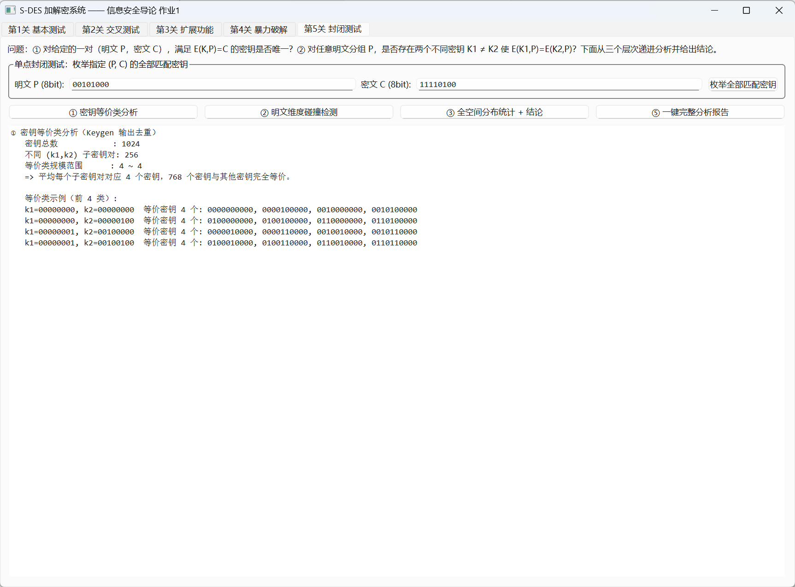
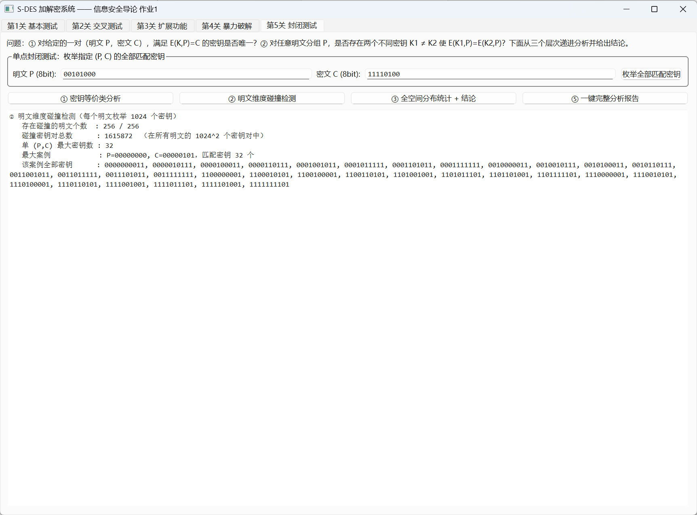
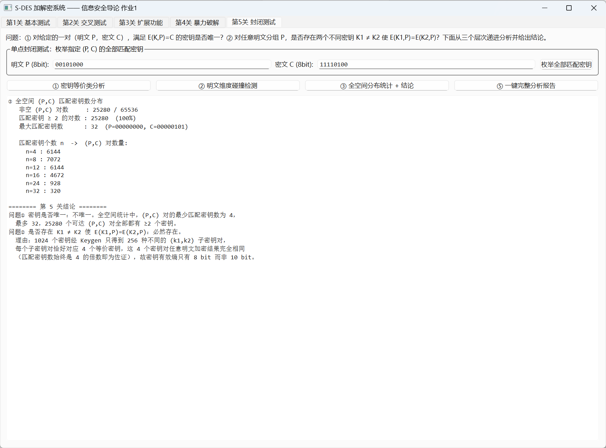
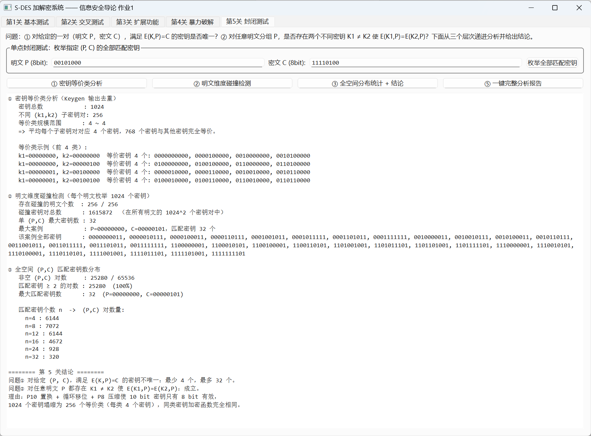

# 关卡 5：封闭测试（密钥是否唯一？密钥多重性分析）

## 一、关卡要求

* **Q1**：对随机选定的一对（明文 P，密文 C），满足 `E(K, P) = C` 的密钥是否唯一？
* **Q2**：对任意明文分组 P，是否存在两个不同密钥 K1 ≠ K2 使 `E(K1, P) = E(K2, P)`？

要求给出结论并说明理由。

## 二、代码文件

| 文件 | 说明 |
|------|------|
| `main.cpp` | 本关卡独立示例程序（单点枚举 + 三层分析 + 结论论证） |
| `CMakeLists.txt` | 单独构建本关卡的构建脚本 |
| `../src/sdes_analysis.h` / `../src/sdes_analysis.cpp` | 密钥多重性分析模块（GUI / 控制台共用） |
| `../src/sdes.h` / `../src/sdes.cpp` | S-DES 核心算法 |

## 三、分析层次（逐层递进）

| 层次 | 分析内容 | 回答的问题 |
|------|----------|------------|
| ① 单点枚举 | 对给定 (P, C) 列出全部匹配密钥 | Q1 |
| ② 密钥等价类 | 1024 个密钥经 Keygen 产生多少种不同 (k1,k2) | 最强的碰撞证据 |
| ③ 明文维度碰撞 | 逐明文检查 1024 个密钥的输出是否重复 | Q2 |
| ④ 全空间分布 | 256×256 个 (P,C) 组合的匹配密钥数分布 | 定量刻画 |

## 四、编译与运行

```bash
./build_levels.sh                 # 或 cmake -B build -G Ninja && cmake --build build
```

```bash
./level5_closure                       # 完整分析报告（①②③④+结论）
./level5_closure 00101000 11110100     # 仅单点枚举
./level5_closure --classes             # 仅密钥等价类
./level5_closure --collision           # 仅明文碰撞
./level5_closure --profile             # 仅全空间分布
```

## 五、实测数据与结论

**① 单点枚举**：P=00101000, C=11110100 的匹配密钥共 **12 个** → 不唯一。

**② 密钥等价类**：1024 个密钥经 Keygen 只产生 **256 种** 不同的 (k1,k2) 子密钥对，
每个等价类**恰好 4 个**密钥 —— 即 768 个密钥与其他密钥完全等价，
**S-DES 的有效密钥熵只有 8 bit 而非 10 bit**。

**③ 明文维度碰撞**：存在碰撞的明文 **256 / 256**（全部命中）；
碰撞密钥对总数 1,615,872。

**④ 全空间分布**：65536 个 (P,C) 组合中仅 25280 个可达，且**全部**为多解；
匹配密钥个数恒为 4 的倍数（n=4: 6144, n=8: 7072, n=12: 6144,
n=16: 4672, n=24: 928, n=32: 320），最大 32 个。

### 结论

> **对随机选定的一对 (P, C)，满足 E(K,P)=C 的密钥【不唯一】；
> 对任意明文 P，都存在 K1 ≠ K2 使 E(K1,P) = E(K2,P)。**

**理由**：

1. 密钥扩展 Keygen 中 P10 置换 + 循环左移 + P8 压缩存在结构冗余，不同主密钥
   会得到完全相同的 (k1, k2)（1024 个密钥只有 256 种子密钥对）；
2. 子密钥对相同的两个密钥对**任何**明文加密结果都相同，1024 个密钥实际只
   等价于 256 个不同的加密函数；
3. 明文/密文空间只有 2^8 = 256，1024 个密钥映射到 256 个密文值上，由
   鸽笼原理必然出现多对一；
4. 因此暴力破解的候选集合恒为一个等价类（4 的倍数个），永远无法从单组
   明密文唯一确定原始密钥。

## 六、GUI 截图

| 截图 | 说明 |
|------|------|
|  | ① 指定 (P,C) 的全部匹配密钥 |
|  | ② 1024 密钥 → 256 等价类 |
|  | ③ 逐明文碰撞检测 |
|  | ④ 全空间分布与结论 |
|  | 一键完整分析报告 |
